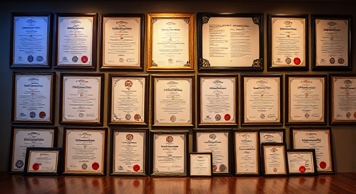

# 🌟 Professional Development & Certifications Portfolio

Welcome to my **Professional Development Portfolio**! This repository highlights my certifications, learning materials, and achievements across technical and professional domains, showcasing my dedication to continuous learning and professional growth.

---

## 🚀 Overview

- **Lifelong Learner:** Constantly exploring tools, technologies, and concepts to enhance my professional skill set.  
- **Certification Showcase:** A collection of accomplishments validating my expertise across various fields.  
- **Skills Demonstrated:** Full-stack development, data analytics, business intelligence, and professional communication.

---

## 📜 Certifications

### 🧑‍💻 Data & Analytics

| **Certification**                        | **Issuer**           | **Preview**                                                                                          | **Certificate Link**                                                                                              |
|------------------------------------------|----------------------|------------------------------------------------------------------------------------------------------|-------------------------------------------------------------------------------------------------------------------|
| SQL Basic Level                          | HackerRank           |        | [View Certificate](https://github.com/ruchisingh-dev/certifications/blob/main/sql_basic-Hackerrank.pdf)            |
| SQL Intermediate Level                   | HackerRank           |          | [View Certificate](https://github.com/ruchisingh-dev/certifications/blob/main/sql_intermediate-Hackerrank.pdf)      |
| SQL Advanced Level                       | HackerRank           |              | [View Certificate](https://github.com/ruchisingh-dev/certifications/blob/main/sql_advanced-Hackerrank.pdf)          |
| Power BI Beginner to Pro Workshop        | Pragmatic Works      |                                                                  | [View Certificate](https://github.com/ruchisingh-dev/certifications/blob/main/PowerBI_BeginnerToPro-Pragmatic.pdf) |
| Excel Beginner to Pro                    | Pragmatic Works      |                                                                   | [View Certificate](https://github.com/ruchisingh-dev/certifications/blob/main/Excel_BeginnerToPro-Pragmatic.pdf)   |
| DAX Functions Workshop                   | Pragmatic Works      |                                                                     | [View Certificate](https://github.com/ruchisingh-dev/certifications/blob/main/DAX_FunctionsWorkshop-Pragmatic.pdf) |
| Power Automate Beginner to Pro Workshop  | Pragmatic Works      |                                                          | [View Certificate](https://github.com/ruchisingh-dev/certifications/blob/main/PowerAutomate_BeginnerToPro.pdf)     |

---

### 💻 Programming & Development

| **Certification**        | **Issuer**      | **Preview**                                                                                            | **Certificate Link**                                                                                 |
|---------------------------|-----------------|--------------------------------------------------------------------------------------------------------|------------------------------------------------------------------------------------------------------|
| GitHub Learning Path      | Great Learning  |  | [View Certificate](https://github.com/ruchisingh-dev/certifications/blob/main/GitHub-GreatLearning.pdf) |

---

### 🌐 Web Development & Design

| **Certification**      | **Issuer** | **Preview**                                                                                            | **Certificate Link**                                                                 |
|------------------------|------------|--------------------------------------------------------------------------------------------------------|-------------------------------------------------------------------------------------|
| UI Path Certification  | UI Path    |      | [View Certificate](https://github.com/ruchisingh-dev/certifications/blob/main/UIPath.pdf) |

---

### 📢 Professional Skills

| **Certification**    | **Issuer** | **Preview**                                                                                            | **Certificate Link**                                                                 |
|-----------------------|------------|--------------------------------------------------------------------------------------------------------|-------------------------------------------------------------------------------------|
| Soft Skills           | NPTEL      |  | [View Certificate](https://github.com/ruchisingh-dev/certifications/blob/main/SoftSkills-NPTEL.pdf) |

---

## 🧠 Skills Acquired

These certifications have helped me build expertise in:

- **Data Analytics & Business Intelligence:** SQL, Power BI, DAX Functions  
- **Programming & Development:** GitHub, JavaScript, React  
- **Business Intelligence Automation:** Power Automate, Excel  
- **Soft Skills:** Communication, Collaboration, and Presentation  

---

## 🛠️ Tools & Technologies

- **Programming:** SQL, JavaScript, React  
- **Business Intelligence:** Power BI, Excel, Power Automate  
- **Collaboration:** GitHub  

---

## 📝 Note

This repository reflects my learning journey. Each certification validates both theoretical and practical understanding of its respective domain.  

_Last Updated: January 2025_

