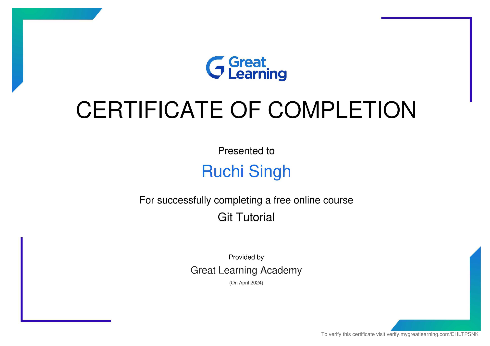

# 🌟 Professional Development & Certifications Portfolio

Welcome to my **Professional Development Portfolio**! This repository highlights my certifications, learning materials, and achievements across technical and professional domains, showcasing my dedication to continuous learning and professional growth.

---

## 🚀 Overview

- **Lifelong Learner:** Constantly exploring tools, technologies, and concepts to enhance my professional skill set.
- **Certification Showcase:** A collection of accomplishments validating my expertise across various fields.
- **Skills Demonstrated:** Full-stack development, data analytics, business intelligence, and professional communication.

---

## 📜 Certifications

### 🧑‍💻 Data & Analytics

| **Certification**                       | **Issuer**      | **Preview**                               | **Certificate Link**                                                                                                                                       |
| --------------------------------------- | --------------- | ----------------------------------------- | ---------------------------------------------------------------------------------------------------------------------------------------------------------- |
| SQL Basic Level                         | HackerRank      | .png>)         | [View Certificate](<https://github.com/ruchisingh-dev/certifications/blob/main/SQL(bas).pdf>)                                                              |
| SQL Intermediate Level                  | HackerRank      | .png>)         | [View Certificate](<https://github.com/ruchisingh-dev/certifications/blob/main/SQL(Int).pdf>)                                                              |
| SQL Advanced Level                      | HackerRank      | .png>)        | [View Certificate](<https://github.com/ruchisingh-dev/certifications/blob/main/SQL(Adv.).pdf>)                                                             |
| Power BI Beginner to Pro Workshop       | Pragmatic Works |         | [View Certificate](https://github.com/ruchisingh-dev/certifications/blob/main/Power%20BI%20Beginner%20to%20Pro%20Workshop%20%20-%20Pragmatic%20Works.pdf)  |
| Excel Beginner to Pro                   | Pragmatic Works |           | [View Certificate](https://github.com/ruchisingh-dev/certifications/blob/main/Excel%20Beginner%20to%20Pro%20-%20Pragmatic%20Works.pdf)                     |
| DAX Functions Workshop                  | Pragmatic Works |             | [View Certificate](https://github.com/ruchisingh-dev/certifications/blob/main/DAX%20Functions%20Workshop%20-%20Pragmatic%20Works.pdf)                      |
| Power Automate Beginner to Pro Workshop | Pragmatic Works |  | [View Certificate](https://github.com/ruchisingh-dev/certifications/blob/main/Power%20Automate%20Beginner%20to%20Pro%20Workshop%20-%20Lakshay%20Kamat.pdf) |

---

### 💻 Programming & Development

| **Certification**    | **Issuer**     | **Preview**                      | **Certificate Link**                                                                                             |
| -------------------- | -------------- | -------------------------------- | ---------------------------------------------------------------------------------------------------------------- |
| GitHub Learning Path | Great Learning |  | [View Certificate](https://github.com/ruchisingh-dev/certifications/blob/main/Gituhb%20-%20Great%20Learning.pdf) |

---

### 🌐 Web Development & Design

| **Certification**     | **Issuer** | **Preview**                                                                                        | **Certificate Link**                                                                         |
| --------------------- | ---------- | -------------------------------------------------------------------------------------------------- | -------------------------------------------------------------------------------------------- |
| UI Path Certification | UI Path    |  | [View Certificate](https://github.com/ruchisingh-dev/certifications/blob/main/UI%20Path.pdf) |

---

### 📢 Professional Skills

| **Certification** | **Issuer** | **Preview**                                                                                                   | **Certificate Link**                                                                                         |
| ----------------- | ---------- | ------------------------------------------------------------------------------------------------------------- | ------------------------------------------------------------------------------------------------------------ |
| Soft Skills       | NPTEL      |  | [View Certificate](https://github.com/ruchisingh-dev/certifications/blob/main/Soft%20Skills%20-%20NPTEL.pdf) |

---

## 🧠 Skills Acquired

These certifications have helped me build expertise in:

- **Data Analytics & Business Intelligence:** SQL, Power BI, DAX Functions
- **Programming & Development:** GitHub, JavaScript, React
- **Business Intelligence Automation:** Power Automate, Excel
- **Soft Skills:** Communication, Collaboration, and Presentation

---

## 🛠️ Tools & Technologies

- **Programming:** SQL, JavaScript, React
- **Business Intelligence:** Power BI, Excel, Power Automate
- **Collaboration:** GitHub

---

## 📝 Note

This repository reflects my learning journey. Each certification validates both theoretical and practical understanding of its respective domain.

_Last Updated: January 2025_
